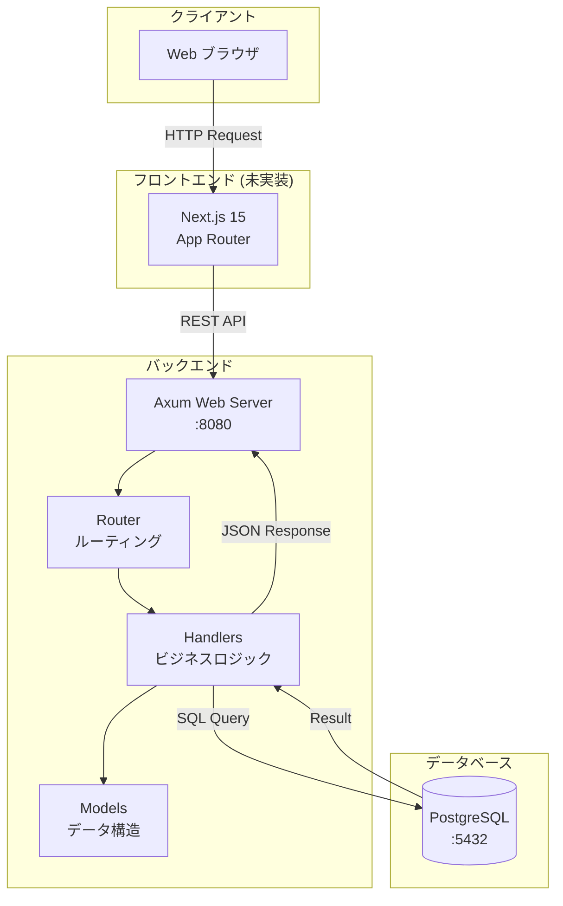
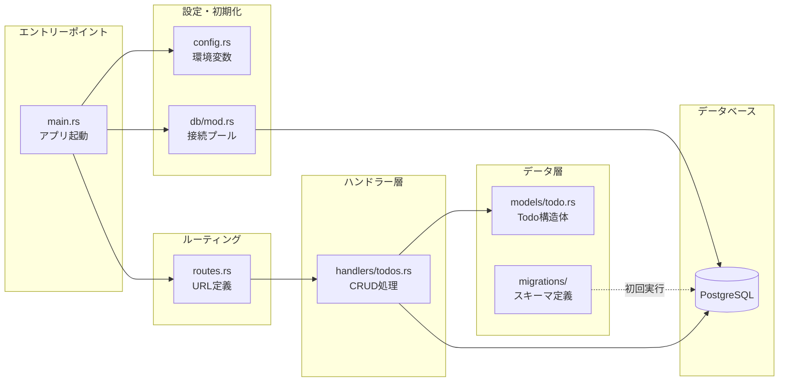
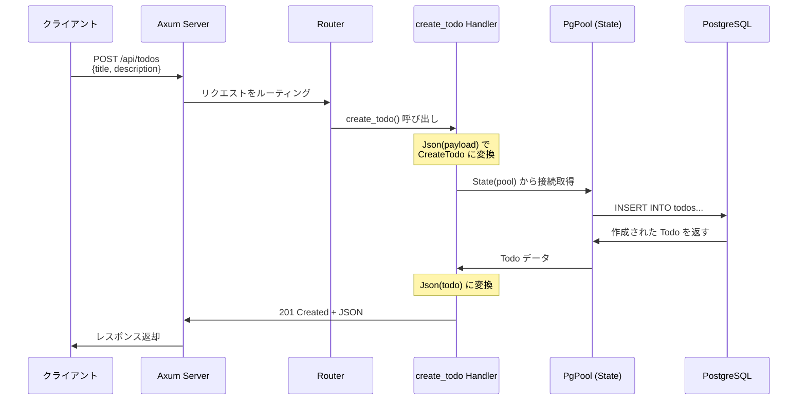
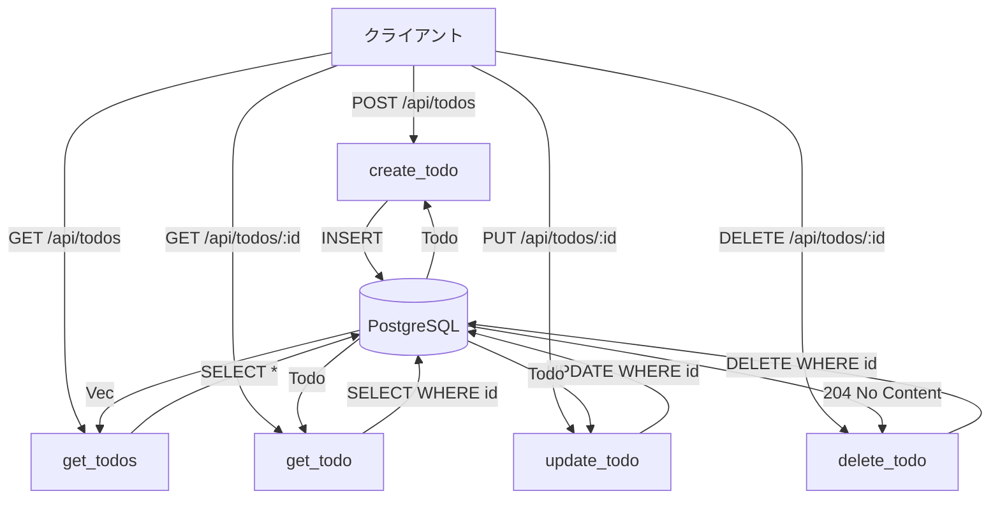
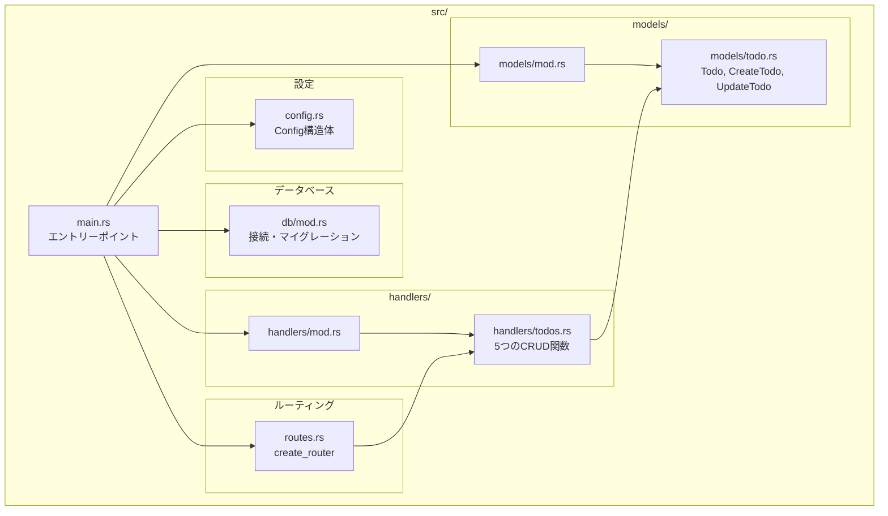
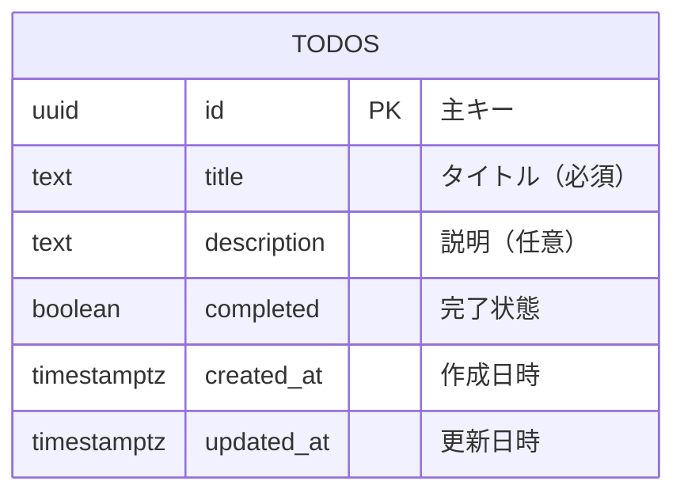

# アーキテクチャドキュメント

## システム全体図



## バックエンドの詳細アーキテクチャ



## データフロー

### リクエストの流れ（例: Todo 作成）



### 全 CRUD 操作のフロー



## モジュール構成



## データモデル



## API エンドポイント

| メソッド | パス | ハンドラー | 説明 |
|---------|------|-----------|------|
| GET | `/api/todos` | `get_todos` | 全 Todo を取得 |
| GET | `/api/todos/:id` | `get_todo` | 特定 Todo を取得 |
| POST | `/api/todos` | `create_todo` | 新規 Todo を作成 |
| PUT | `/api/todos/:id` | `update_todo` | Todo を更新 |
| DELETE | `/api/todos/:id` | `delete_todo` | Todo を削除 |

## 技術スタック詳細

### Backend
- **言語**: Rust 2021 Edition
- **Web Framework**: Axum 0.7
- **非同期ランタイム**: Tokio 1.x
- **データベースドライバ**: SQLx 0.7
- **シリアライゼーション**: Serde 1.0
- **ロギング**: tracing + tracing-subscriber
- **エラーハンドリング**: anyhow + thiserror

### Database
- **RDBMS**: PostgreSQL 16
- **マイグレーション**: SQLx migrations
- **接続プール**: SQLx PgPool (max 5 connections)

### Infrastructure
- **コンテナ**: Docker + Docker Compose
- **開発環境**: Docker による一括管理

## 主要な設計パターン

### 1. レイヤードアーキテクチャ

```
┌─────────────────────┐
│   Routes (ルーティング)  │
├─────────────────────┤
│  Handlers (ハンドラー)   │
├─────────────────────┤
│  Models (データモデル)   │
├─────────────────────┤
│  Database (永続化)   │
└─────────────────────┘
```

### 2. 依存性注入（State パターン）

```rust
// Router に State を登録
Router::new()
    .route("/api/todos", get(get_todos))
    .with_state(pool)  // ← pool を注入

// Handler で State を受け取る
async fn get_todos(State(pool): State<PgPool>) {
    // pool が自動的に渡される
}
```

### 3. エクストラクターパターン

Axum のエクストラクターを活用：
- `State<T>`: アプリケーション状態
- `Json<T>`: リクエスト/レスポンスボディ
- `Path<T>`: URL パラメータ

## セキュリティ考慮事項

1. **SQL インジェクション対策**: SQLx のプレースホルダー (`$1, $2`) を使用
2. **型安全性**: Rust の型システムでコンパイル時チェック
3. **エラーハンドリング**: すべてのエラーを適切に処理し、ログに記録

## パフォーマンス最適化

1. **接続プール**: データベース接続を再利用（最大5接続）
2. **非同期処理**: Tokio による効率的な並行処理
3. **インデックス**: `completed` と `created_at` にインデックスを設定

## 今後の拡張予定

- [ ] フロントエンド（Next.js）の実装
- [ ] 認証・認可機能
- [ ] ページネーション
- [ ] フィルタリング・検索機能
- [ ] Todo のカテゴリー・タグ機能
